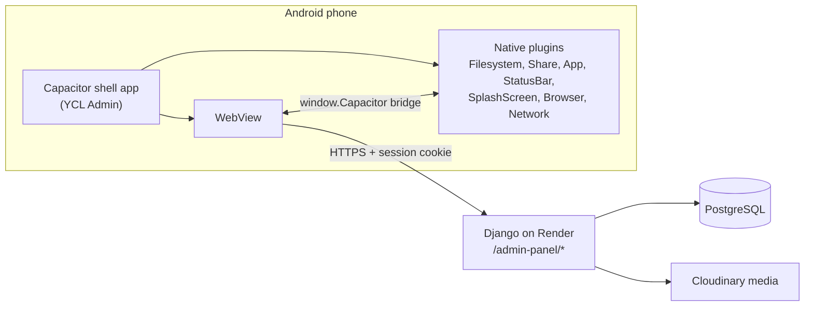

# Youth Club Library — Admin Mobile App: Implementation Plan (Handoff Document)

> **For the new chat / agent:** This document is self-contained. Read it fully before touching code.
> Goal of this phase: ship an **Android admin app** that contains **every existing admin-panel feature**, with the **same design as the website**. **Barcode / POS features are explicitly OUT OF SCOPE for now** (see §10).

---

## 1. Decision Already Made — "Option A" (Hybrid App)

The admin app is a **native Android shell built with Capacitor** that loads the **live Django admin panel** (`https://youthclublibrary.com/admin-panel/`) inside a WebView, plus a few native integrations (file downloads, uploads, back button, status bar, splash).

Why: identical design to the website, all ~70 admin screens available on day one, one codebase — any change on the website updates the app instantly with no re-release.

**Consequences:**
- **No new REST API** and **no React Native/Flutter screens** in this phase.
- Most work = (a) making the existing Django admin templates genuinely mobile-friendly, (b) building the Capacitor shell.
- **No database model changes are required in this phase.** The models in §4 must stay as they are.

---

## 2. Project Context

| Item | Value |
|---|---|
| Django project root | `C:\Users\Lenovo\.gemini\antigravity\scratch\youth_club_library` |
| Django settings module | `youth_club_library.settings` |
| Apps | `accounts`, `catalog`, `orders`, `panel` (panel has **no models**, only views/urls) |
| Python/Django | Django `>=4.2,<5.2`, django-allauth (email login + Google), python-decouple, Pillow, xhtml2pdf (PDFs), whitenoise, cloudinary storage, dj-database-url, psycopg2 |
| Database | PostgreSQL via `DATABASE_URL` env var (Supabase); SQLite fallback locally |
| Media storage | Cloudinary in production |
| Hosting | Render, auto-deploys on push to `main` |
| Domain | `https://youthclublibrary.com` (also `https://youth-club-library.onrender.com`) |
| Git | branch `main`, remote `https://github.com/md-imam75/Youth-Club-Library.git` |
| Timezone / currency | `Asia/Dhaka`, Bangladeshi Taka `৳` |
| Front-end | Tailwind CSS via CDN (`cdn.tailwindcss.com`, `darkMode: 'class'`), Alpine.js 3 via CDN, Inter + Bornomala (Bangla) fonts, light/dark toggle stored in `localStorage.theme` |
| Admin URL prefix | `/admin-panel/` → `panel/urls.py` |
| Admin access control | `@staff_required` decorator in `panel/views.py` (line ~32): `u.is_active and u.is_staff` |
| Login URL | `/accounts/login/` (allauth); `LOGIN_REDIRECT_URL = '/dashboard/'` |
| Session | `SESSION_COOKIE_AGE = 7 days`, `SESSION_COOKIE_SAMESITE='Lax'`, secure cookies in prod |
| Dev machine | **Windows, PowerShell** (`&&` does NOT work — use `;`). Node v22.12 + npm 10.9 installed. **No Java, no Android SDK installed yet.** |
| Testing tip | Django test client needs `Client(SERVER_NAME='127.0.0.1')` to avoid `DisallowedHost`. `python manage.py check` must pass. |

### Owner's preferences (important)
- Strongly dislikes "AI-looking" design: **no gradient text, no loud gradient buttons, no over-decoration**. Wants **minimal, modern, professional**, matching the site's existing **sky-500/600 accent + slate neutrals + glass cards** aesthetic, in **both light and dark mode**.
- Existing reusable classes in `templates/admin_panel/base.html`: `.glass`, `.stat-card`, `.sidebar-link(.active)`, `.btn-primary`, `.btn-danger`, `.btn-success`, `.btn-warn`, `.form-input`, `.table-row`, `.badge-pending`. **Reuse these** rather than inventing new styles.
- Commit locally; **only `git push` when the owner says so.**

---

## 3. Current Admin Panel — Full Feature Inventory (all must work in the app)

Base layout: `templates/admin_panel/base.html` (sidebar + top bar + flash messages + ``).

| Area | URL name(s) (`panel/urls.py`) | Template(s) |
|---|---|---|
| Dashboard | `admin_dashboard` | `dashboard.html` |
| Membership requests | `admin_memberships`, `admin_membership_action` | `memberships.html` |
| Users | `admin_users`, `admin_user_detail` | `users.html`, `user_detail.html` |
| Membership plans CRUD | `admin_plans`, `admin_plan_add/edit/delete` | `plans.html`, `plan_form.html`, `plan_confirm_delete.html` |
| Books CRUD | `admin_books`, `admin_book_add/edit/delete` | `books.html`, `book_form.html`, `book_confirm_delete.html` |
| Authors CRUD | `admin_authors`, `admin_author_add/edit/delete` | `authors.html`, `author_form.html`, `confirm_delete.html` |
| Publications CRUD | `admin_publications`, `admin_publication_add/edit/delete` | `publications.html`, `publication_form.html`, `confirm_delete.html` |
| Categories CRUD | `admin_categories`, `admin_category_add/edit/delete` | `categories.html`, `category_form.html`, `confirm_delete.html` |
| Orders (buy) & borrow requests | `admin_orders` (`?type=Borrow`), `admin_order_action`, `admin_approve_borrow` | `orders.html`, `approve_borrow.html` |
| Book requests | `admin_book_requests`, `admin_book_request_action/delete` | `requests.html` |
| Walk-in (offline) billing | `admin_bill_list`, `admin_make_bill`, `admin_bill_edit`, `admin_bill_download_pdf`, `admin_book_search_ajax` | `bills.html`, `make_bill.html`, `bill_edit.html`, `bill_pdf.html`, `bill_email.html/.txt` |
| Sales reports | `admin_sales_report`, `admin_sales_report_pdf` | `sales_report.html`, `sales_report_pdf.html` |
| Social links CRUD | `admin_social_links`, `..._add/edit/delete` | `social_links.html`, `social_link_form.html` |
| Testimonials CRUD | `admin_testimonials`, `..._add/edit/delete` | `testimonials.html`, `testimonial_form.html` |
| Delivery options CRUD | `admin_delivery_options`, `..._add/edit/delete` | `delivery_options.html`, `delivery_option_form.html` |
| AJAX helpers | `admin_create_ajax` (quick-create author/publication/category), `publication_discount_ajax` | used inside forms |

Existing stock logic (keep as-is): walk-in bill decrements `Book.stock_quantity` (`panel/views.py` ~L1159); order cancel/return restores stock; online checkout decrements stock (`orders/views.py`). `Book.save()` emails the waitlist when stock goes from 0 → >0.

**Known mobile problems in the current panel** (to fix in Phase 1):
- Sidebar never fully hides on phones (collapses to a `w-16` rail, eating screen width); content uses `p-6`.
- 17 templates use wide `<table>`s (authors, bills, bill_edit, books, categories, delivery_options, make_bill, memberships, orders, publications, requests, sales_report, social_links, testimonials, users, + PDF templates which should be left alone).
- PDF links (`/pdf/`) rely on browser downloads — **Android WebView does not download files by itself**.
- Small tap targets, hover-only affordances.

---

## 4. Database Models (CURRENT — DO NOT CHANGE IN THIS PHASE)

### accounts/models.py
```python
class CustomUser(AbstractUser):          # AUTH_USER_MODEL = 'accounts.CustomUser'
    email = EmailField(unique=True)       # USERNAME_FIELD = 'email'
    phone = CharField(max_length=15, blank=True)
    address = TextField(blank=True)
    profile_image = ImageField(upload_to='profiles/', blank=True, null=True)
    date_of_birth = DateField(null=True, blank=True)
    bio = TextField(blank=True, max_length=500)
    created_at = DateTimeField(auto_now_add=True); updated_at = DateTimeField(auto_now=True)
    REQUIRED_FIELDS = ['username', 'first_name', 'last_name']
    # props: active_membership, has_active_membership; is_staff / is_superuser from AbstractUser

class MembershipPlan(Model):
    name = CharField(100, unique=True); price = DecimalField(10,2)
    duration_days = IntegerField(default=30); characteristics = JSONField(default=list)
    is_active = BooleanField(True); is_popular = BooleanField(False); sort_order = IntegerField(0)

class UserMembership(Model):
    user = OneToOneField(CustomUser, CASCADE, related_name='membership')
    plan = ForeignKey(MembershipPlan, SET_NULL, null=True, related_name='memberships')
    unique_membership_id = CharField(12, unique=True, default=generate_membership_id)  # 'YCL' + 9 digits
    status = CharField(choices=Pending/Active/Expired, default='Pending')
    transaction_id = CharField(100, blank=True)
    payment_method = CharField(choices=Offline/bKash/Nagad, default='Offline')
    created_at, activated_at, expires_at = DateTimeField(...); notes = TextField(blank=True)
    # methods: activate(), check_expiry(); prop days_remaining
```

### catalog/models.py
```python
class Author(Model):      name CharField(200); description TextField; image ImageField('authors/'); created_at
class Publication(Model): name CharField(200); description TextField; logo ImageField('publications/');
                          website URLField(blank); default_discount_percent DecimalField(5,2, default=0); created_at
class Category(Model):    name CharField(100, unique); description TextField; image ImageField('categories/');
                          slug SlugField(unique, auto from name)

class Book(Model):
    title = CharField(300)
    author / publication / category = ForeignKey(..., SET_NULL, null=True, related_name='books')
    cover_image = ImageField('books/covers/'); description = TextField(blank=True)
    isbn = CharField(20, unique=True, null=True, blank=True); pages = IntegerField(null)
    language = CharField(50, default='Bangla'); edition = CharField(50, blank)
    regular_price = DecimalField(10,2); offer_price = DecimalField(10,2, null)   # effective = offer or regular
    buying_price = DecimalField(10,2)          # admin-only, never show to customers
    wafilife_price = DecimalField(10,2, null); wafilife_url = URLField(blank)
    stock_quantity = IntegerField(default=0); can_borrow = BooleanField(True)
    is_featured / is_new / is_upcoming = BooleanField(False)
    created_at, updated_at
    # props: effective_price, discount_percent, is_in_stock, average_rating, review_count
    # save(): if stock 0 -> >0, emails WaitlistEntry users in a thread, then deletes waitlist

class BookReview(Model):      user FK, book FK(related 'reviews'), rating 1-5, review_text, created_at; unique(user, book)
class SocialMediaLink(Model): name, url, icon_type(facebook/telegram/whatsapp/linkedin/other), is_active
class BookRequest(Model):     user FK(null), name, address, phone, email, status(Pending/Reviewed/Completed), created_at
class BookRequestItem(Model): request FK(related 'items'), book_title, author, publication, quantity
class WaitlistEntry(Model):   user FK, book FK(related 'waitlist_entries'), created_at; unique(user, book)
class SiteTestimonial(Model): name, role, rating, review_text, is_active, created_at
```

### orders/models.py
```python
class Order(Model):   # one row per book; multi-book checkouts share group_number
    user = FK(CustomUser, CASCADE, null=True, related_name='orders')
    customer_name / customer_mobile / customer_email / bill_number = CharField(blank)
    book = FK(Book, CASCADE, related_name='orders')
    order_type = 'Buy' | 'Borrow'; quantity = PositiveIntegerField(1)
    order_status = 'Pending' | 'Delivered' | 'Cancelled'
    delivery_option = CharField(100)  # DeliveryOption.code; delivery_address; delivery_cost Decimal(8,2)
    book_price = Decimal(10,2); total_cost = Decimal(10,2); group_number = CharField(50, db_index)
    payment_method = 'Offline' | 'bKash' | 'Nagad'; transaction_id; payment_status = 'Pending'|'Paid'|'Failed'
    created_at; due_date (borrow); returned_at; admin_notes
    # props: order_number ('YCL-YYYYMMDD-NNNN'), group_total_cost, delivery_option_label,
    #        days_remaining, days_overdue, is_returned, is_overdue; method mark_returned() restores stock

class OfflineBill(Model):      # walk-in sale
    bill_number = CharField(50, unique); customer_name; customer_mobile; customer_email
    payment_method = 'cash' | 'bkash'; total_amount = Decimal(12,2); created_at
class OfflineBillItem(Model):
    bill = FK(OfflineBill, CASCADE, related_name='items'); book = FK(Book, SET_NULL, null=True)
    book_title, author_name, publication_name (snapshots); quantity
    regular_price, offer_price(null), discount_percent, total_price
class DeliveryOption(Model):   label(unique), code Slug(unique), cost Decimal(8,2), is_active, created_at
```

---

## 5. Target Architecture



- The WebView loads `https://youthclublibrary.com/admin-panel/` directly (Capacitor `server.url`). Cookies are first-party → normal Django session + CSRF work unchanged.
- Django detects "app mode" so templates can adapt (e.g. hide "back to website" links, use native download helper).

---

## 6. Phase 1 — Make the Admin Panel Mobile-Ready (Django side)

All changes inside the existing Django project. **Desktop layout must remain unchanged** at `lg` (≥1024px) and above.

### 6.1 App-mode detection
- Capacitor shell appends a custom token to the user agent (`appendUserAgent: 'YCLAdminApp/1.0'` in `capacitor.config.ts`).
- Add context processor `panel/context_processors.py` → `is_app = 'YCLAdminApp' in request.META.get('HTTP_USER_AGENT', '')`; register in `settings.TEMPLATES[...]['context_processors']`.
- Use `` in templates only where behaviour must differ (downloads, external links, "Home" link).

### 6.2 Responsive `admin_panel/base.html`
1. **Sidebar → off-canvas drawer below `lg`**: hidden by default on mobile, slides in over content with a dimmed backdrop, closes on backdrop tap / link tap / Android back. Keep the current collapsible rail behaviour on desktop.
2. **Mobile top bar**: hamburger, page title (truncate), theme toggle, avatar. Sticky, respects `env(safe-area-inset-top)`.
3. **Bottom navigation bar (mobile only, `lg:hidden`)**: 5 items — Dashboard, Orders, Make Bill, Books, More (opens drawer). Glass style, sky accent for active item, `env(safe-area-inset-bottom)` padding. Add bottom padding to `<main>` so content isn't hidden.
4. `<main>` padding `p-4 lg:p-6`; add `<meta name="theme-color">` for light/dark; `viewport-fit=cover`.
5. Tap targets ≥ 44px; no hover-only actions (always show action buttons on mobile).
6. Flash messages: fixed toast at top on mobile, auto-dismiss after ~4s.

### 6.3 Tables → mobile card lists
For each list template (books, authors, publications, categories, users, memberships, orders, requests, bills, social_links, testimonials, delivery_options, plans, sales_report):
- Keep the `<table>` for `md:` and up (`hidden md:table` or wrap in `hidden md:block overflow-x-auto`).
- Add a `md:hidden` stacked **card list** rendering the same rows: primary line (title/name), secondary meta (price, stock, status badge), and the row's action buttons as a full-width button row.
- Filters/search bars: stack vertically on mobile, full-width inputs.
- Pagination: larger buttons, centered.
- **Do NOT touch PDF templates** (`bill_pdf.html`, `sales_report_pdf.html`) — they render for xhtml2pdf.

### 6.4 Forms (book, author, publication, category, plan, social link, testimonial, delivery option, make_bill, bill_edit)
- Single column on mobile, 2-col grid from `md:`.
- Sticky bottom action bar on mobile (Cancel / Save) above the bottom nav.
- Correct input types (`inputmode="decimal"` for prices, `inputmode="numeric"` for quantities, `type="tel"` for phones, `type="email"`).
- Image inputs: add `accept="image/*"` (Android then offers camera or gallery).
- `make_bill.html`: the book search + line items must be usable one-handed — search results as a full-width dropdown list, line items as cards with +/− quantity steppers, grand total pinned at the bottom.

### 6.5 Dashboard
- Stat cards: 2 per row on mobile; charts (if any) full width and scroll-safe.

### 6.6 PDFs & downloads in app mode
WebView cannot download files. In `base.html` add a small JS helper used when `is_app`:
- Intercept clicks on links marked `data-download` (bill PDF, sales report PDF).
- `fetch(url, {credentials: 'include'})` → blob → base64 → `Capacitor.Plugins.Filesystem.writeFile({directory: 'Documents' or 'Cache'})` → `Capacitor.Plugins.Share.share({files:[uri]})` (lets admin open/print/send via WhatsApp etc.).
- On the normal website (not app) links behave exactly as today.

### 6.7 External links
In app mode, links to other domains (publication websites, wafilife, social links, `mailto:`, `tel:`, `https://wa.me/...`) must open via `Capacitor.Plugins.Browser.open()` or the system handler, not inside the admin WebView.

### 6.8 Login inside the app
- **Google sign-in will NOT work inside a WebView** (Google blocks embedded user agents: `disallowed_useragent`). Staff must log in with **email + password** in the app. In app mode, hide the Google button on `templates/account/login.html` and show a hint.
- After login, staff should land on `/admin-panel/` (not `/dashboard/`) when `is_app` — e.g. app's start URL `https://youthclublibrary.com/accounts/login/?next=/admin-panel/`.
- If a non-staff user logs in inside the app, show a friendly "This app is for library staff only" page with a logout button (not a raw 302/403 loop).
- Optional: longer session for the app (e.g. 30 days) — set `request.session.set_expiry(...)` for staff when `is_app`. Ask owner first.

### 6.9 Phase 1 acceptance
- Every page in §3 usable at 360×800 in light and dark mode, no horizontal scrolling (except deliberately scrollable tables on tablets), desktop pixel-identical to before.
- `python manage.py check` passes; smoke-test each admin URL with the test client (status 200 for a staff user).

---

## 7. Phase 2 — Capacitor Android Shell

### 7.1 Prerequisites (install on the Windows machine)
1. **Android Studio** (latest) — includes JDK 21 + Android SDK. After install: SDK Platform 35 (Android 15), Build-Tools, Platform-Tools.
2. Set env vars: `JAVA_HOME` → Android Studio's `jbr` folder; `ANDROID_HOME` → `%LOCALAPPDATA%\Android\Sdk`; add `platform-tools` to PATH.
3. A phone with USB debugging, or an emulator.

### 7.2 Project location & creation
Create a **separate folder** (not inside the Django repo, or as its own git repo):
`C:\Users\Lenovo\.gemini\antigravity\scratch\ycl_admin_app`

```powershell
npm init -y
npm i @capacitor/core @capacitor/android @capacitor/app @capacitor/status-bar @capacitor/splash-screen @capacitor/filesystem @capacitor/share @capacitor/browser @capacitor/network
npm i -D @capacitor/cli @capacitor/assets
npx cap init "YCL Admin" com.youthclublibrary.admin --web-dir www
npx cap add android
```

`www/` only holds a tiny offline/error page (`www/index.html`) styled like the site (logo, "No internet connection", Retry button).

### 7.3 `capacitor.config.ts`
```ts
import type { CapacitorConfig } from '@capacitor/cli';
const config: CapacitorConfig = {
  appId: 'com.youthclublibrary.admin',
  appName: 'YCL Admin',
  webDir: 'www',
  server: {
    url: 'https://youthclublibrary.com/admin-panel/',
    allowNavigation: ['youthclublibrary.com', 'www.youthclublibrary.com', 'res.cloudinary.com'],
    errorPath: 'index.html',          // shown when offline / server unreachable
  },
  android: { appendUserAgent: 'YCLAdminApp/1.0' },
  plugins: {
    SplashScreen: { launchShowDuration: 1200, backgroundColor: '#050a14' },
  },
};
export default config;
```
(Render free tier may cold-start slowly — keep the splash until first page load, or show a branded loading state.)

### 7.4 Native behaviour (small JS injected by Django base.html when `is_app`, using `window.Capacitor.Plugins`)
- **Android back button** (`App.addListener('backButton')`): close drawer/modal if open → else `history.back()` → else confirm exit.
- **Status bar**: match theme (`#050a14` dark / `#f8fafc` light) and update on theme toggle.
- **Network**: on offline, show a non-blocking banner; forms shouldn't silently fail.
- **Pull-to-refresh**: simple custom implementation on list pages (optional).
- Downloads & external links: see §6.6 / §6.7.

### 7.5 App identity
- Icon & splash generated from `static/images/logo.png` via `npx @capacitor/assets generate` (dark bg `#050a14`).
- App name "YCL Admin", package `com.youthclublibrary.admin`.
- Android permissions: INTERNET (default). Camera/storage permissions only if file chooser needs them (Capacitor's WebView handles `<input type=file accept="image/*">`; verify camera option appears, add `CAMERA` permission if needed).

### 7.6 Build & run
```powershell
npx cap sync android
npx cap open android      # build/run from Android Studio
# or CLI debug build:
cd android; .\gradlew assembleDebug   # -> android\app\build\outputs\apk\debug\app-debug.apk
```
Release: create a keystore (`keytool -genkey ...`), configure signing in Android Studio, build **signed APK** (sideload to staff phones) and/or **AAB** (Play Store). **Back up the keystore + passwords** — losing it means you can never update the app.

### 7.7 Django settings to verify
- `CSRF_TRUSTED_ORIGINS` already includes `https://youthclublibrary.com` — sufficient because the WebView origin *is* the site.
- `SECURE_SSL_REDIRECT` is on in prod — always use the `https://` URL in `server.url`.
- No CORS package needed (no cross-origin API calls in this phase).

---

## 8. Phase 3 — Testing Checklist (on a real Android phone, light + dark)

- [ ] Login with email/password → lands on dashboard; Google button hidden in app; non-staff gets "staff only" page.
- [ ] Session survives closing/reopening the app.
- [ ] Drawer navigation reaches every page in §3; bottom nav works; back button behaves.
- [ ] Each CRUD: list → add (with image from camera AND gallery) → edit → delete confirmation → flash message.
- [ ] Quick-create author/publication/category from book form (AJAX) works.
- [ ] Membership approve/reject; order status actions; borrow approval & return (stock restored).
- [ ] Make walk-in bill: search books, change quantities, save → stock decremented → bill PDF downloads & opens/shares.
- [ ] Bill edit; bill email sending.
- [ ] Sales report filters + PDF download/share.
- [ ] External links (publication website, social links, wafilife) open outside the app.
- [ ] Airplane mode → offline page/banner; Retry recovers.
- [ ] Desktop admin panel at ≥1024px looks exactly as before.

---

## 9. Suggested Order of Work & Commits

1. `panel/context_processors.py` + settings registration (app mode).
2. `admin_panel/base.html` responsive shell (drawer, top bar, bottom nav, toasts, safe areas, app-mode JS helpers).
3. List templates → card lists (one commit per 3–4 templates).
4. Forms + `make_bill.html` mobile UX.
5. Login page app-mode tweaks + staff-only guard page.
6. Capacitor project, config, icon/splash, offline page.
7. Native integrations (back button, status bar, downloads, external links).
8. Device testing (§8), fixes, signed release APK.

Commit after each step; **push to `main` only when the owner approves** (push triggers a Render deploy, which the app loads live).

---

## 10. Out of Scope for This Phase (planned for later — do NOT build now)

Barcode/POS will be built after the app ships. Decisions already agreed, recorded here so nothing in this phase blocks them:
- **One barcode per book title (SKU), not per copy.** Restocking = increase `stock_quantity` and print more copies of the *same* sticker; each scan sells 1 unit of that title.
- Future additions (later phase): `Book.barcode` field, sticker sheet printing (A4 or thermal label printer), stock-in/restock records + stock movement ledger, cash register (cash received / change given), POS invoice, native camera barcode scanner plugin in this same Capacitor app (e.g. `@capacitor-mlkit/barcode-scanning`), Bluetooth receipt printing.
- Keep Phase 1 templates/JS modular so a "Scan" button can later be added to the bottom nav and to `make_bill.html` without redesign.
